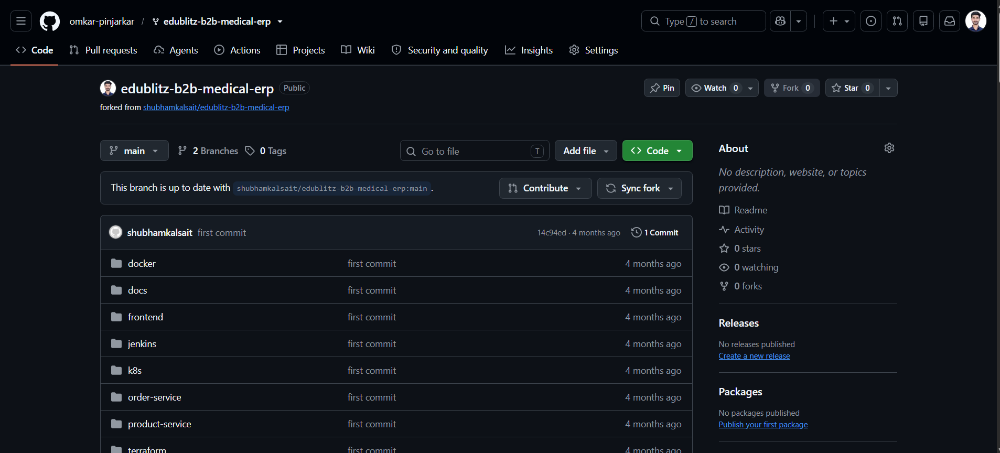
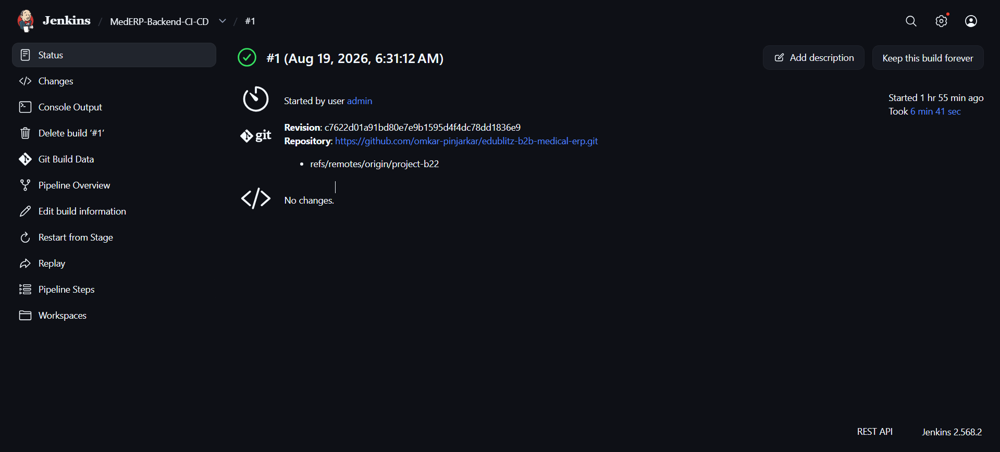
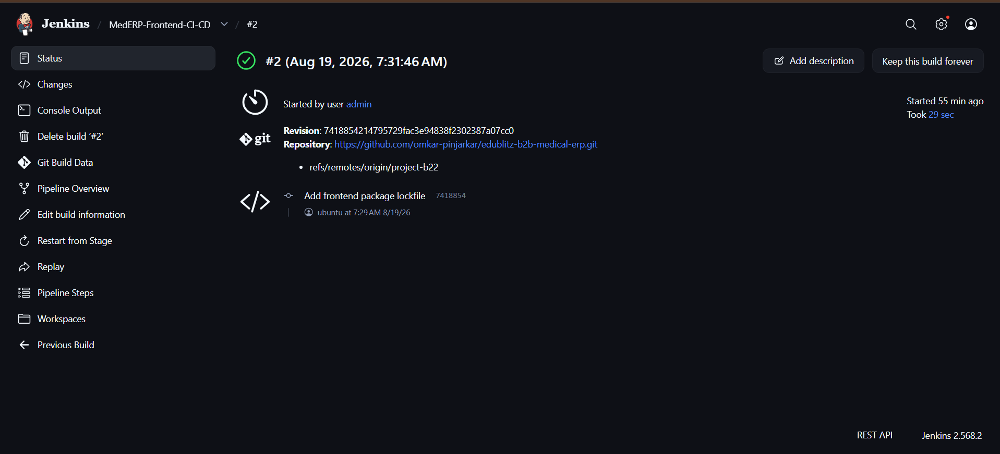
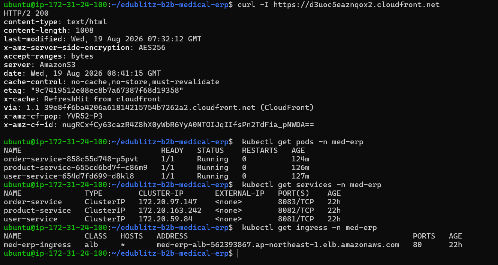
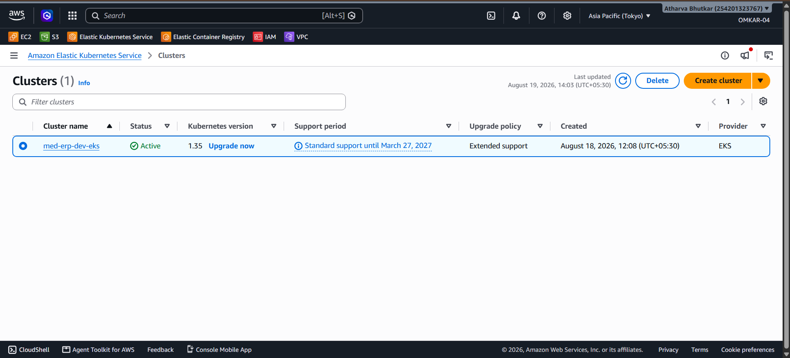
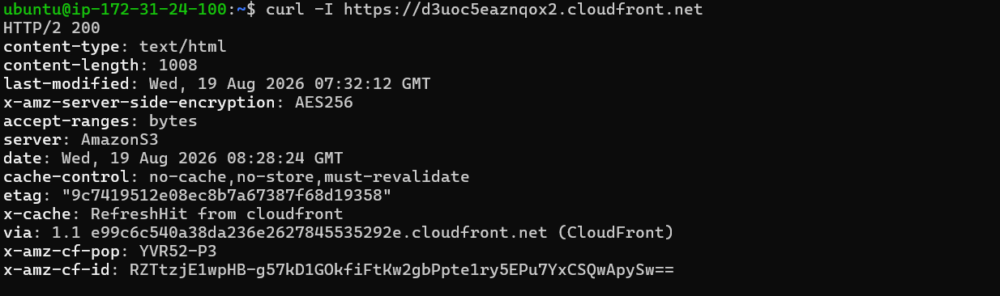

# EduBlitz Medical B2B ERP System

A production-grade **Medical Domain B2B ERP** for hospitals, distributors, and administrators.

The system is built using **three Spring Boot microservices**, a **React (Vite)** frontend, and **MongoDB**. The project also includes a complete DevOps implementation using **Docker, Kubernetes, AWS EKS, Terraform, Jenkins CI/CD, Amazon ECR, Amazon S3, and CloudFront**.

---

## Architecture Overview

```text
┌─────────────────────────────────────────────────────────────────┐
│                        CloudFront CDN                           │
│                    React Frontend via S3                        │
└──────────────────────────┬──────────────────────────────────────┘
                            │
                            │ /api/v1/*
                            ▼
┌─────────────────────────────────────────────────────────────────┐
│          AWS Application Load Balancer (ALB)                    │
│       Managed by AWS Load Balancer Controller                   │
│                         on EKS                                  │
└──────┬─────────────────────┬──────────────────────┬─────────────┘
       │                     │                      │
       ▼                     ▼                      ▼
┌──────────────┐     ┌────────────────┐     ┌────────────────┐
│ user-service │     │ product-service│     │ order-service  │
│ Port: 8081   │     │ Port: 8082     │     │ Port: 8083     │
│              │     │                │     │                │
│ Auth / JWT   │     │ Catalog / Stock│     │ Order lifecycle│
│ Roles / Orgs │     │ Batches /      │     │ Product API    │
│              │     │ Reservation    │     │                │
└──────┬───────┘     └───────┬────────┘     └───────┬────────┘
       │                     │                       │
       └─────────────────────┼───────────────────────┘
                              │
                              ▼
┌─────────────────────────────────────────────────────────────────┐
│                        MongoDB Atlas                             │
│       users_db        products_db        orders_db               │
└─────────────────────────────────────────────────────────────────┘
```

## Tech Stack

| Layer | Technology |
|---|---|
| Frontend | React 18, Vite, TailwindCSS, TanStack Query |
| Backend | Spring Boot 3.x |
| Architecture | Three Spring Boot microservices |
| Database | MongoDB / MongoDB Atlas |
| Authentication | JWT, HMAC-SHA256 / HS256 |
| Containers | Docker |
| Orchestration | Kubernetes / Amazon EKS |
| Load Balancing | AWS Application Load Balancer |
| Cloud | AWS |
| Infrastructure as Code | Terraform |
| CI/CD | Jenkins |
| Container Registry | Amazon ECR |
| Frontend Hosting | Amazon S3 |
| CDN | Amazon CloudFront |
| API Documentation | Swagger / OpenAPI 3.0 |

## Domain Highlights

- **Catalog:** Active products appear in hospital/distributor listings. Soft-deleted products free their SKU for reuse.
- **Inventory:** Stock is tracked per product + warehouse + batch. Available sellable stock is calculated as stored quantity minus reserved quantity.
- **Orders:** Hospitals create orders. Distributors or administrators approve orders only when sufficient sellable stock is available.
- **Stock Reservation:** Order approval calls the product-service to reserve stock using multi-batch allocation.
- **Organization Scoping:** Distributors can act only on orders assigned to their organization.
- **Administration:** Organization MongoDB IDs are available through the Organizations section for integration and user registration.

## Microservices

| Service | Port | Responsibilities |
|---|---|---|
| user-service | 8081 | Authentication, JWT, users, organizations, audit hooks |
| product-service | 8082 | Products, inventory batches, stock reservation/release |
| order-service | 8083 | Orders and communication with product-service |

## Service Communication

```text
Frontend
   │
   ▼
AWS ALB
   │
   ├──► user-service
   │
   ├──► product-service
   │
   └──► order-service
             │
             │ HTTP + forwarded JWT
             ▼
       product-service
```

The services maintain separate database boundaries and do not use a shared database.

## Roles

| Role | Access |
|---|---|
| ADMIN | Organizations, products/inventory, and all orders |
| DISTRIBUTOR | Own catalog, stock batches, and incoming orders for their organization |
| HOSPITAL | Browse catalog and create/track orders for their organization |

## Project Structure

```text
├── frontend/           # React + Vite frontend
├── user-service/       # Authentication and user management
├── product-service/    # Product catalog and inventory
├── order-service/      # Order management
├── docker/             # Docker Compose and environment configuration
├── k8s/                # Kubernetes manifests
├── terraform/          # Modular Terraform infrastructure
├── jenkins/             # Jenkins CI/CD pipelines
└── docs/                # Deployment and architecture documentation
```

## Documentation

| Document | Description |
|---|---|
| `docs/README.md` | Documentation index |
| `docs/MANUAL_DEPLOYMENT.md` | Run services locally without Docker |
| `docs/DOCKER_DEPLOYMENT.md` | Docker Compose deployment with MongoDB Atlas |
| `docs/KUBERNETES_DEPLOYMENT.md` | EKS and AWS Load Balancer Controller deployment |
| `k8s/README.md` | Kubernetes deployment/apply order |
| `docs/TERRAFORM_DEPLOYMENT.md` | AWS infrastructure deployment |
| `terraform/README.md` | Terraform modules and infrastructure |
| `docs/JENKINS_DEPLOYMENT.md` | Jenkins CI/CD deployment |
| `docs/ARCHITECTURE.md` | Service boundaries and data flows |

## Quick Start

### 1. Local Development

See: `docs/MANUAL_DEPLOYMENT.md`

The frontend uses HashRouter, for example:

```
http://localhost:5173/#/login
```

### 2. Docker Compose

See: `docs/DOCKER_DEPLOYMENT.md`

Docker Compose is used for the backend APIs, while MongoDB Atlas can be configured through environment variables.

### 3. Kubernetes

See: `docs/KUBERNETES_DEPLOYMENT.md` and `k8s/README.md`

### 4. Terraform

See: `docs/TERRAFORM_DEPLOYMENT.md`

## Prerequisites

| Tool | Requirement |
|---|---|
| JDK | 17 |
| Maven | 3.9+ |
| Node.js | 18+ |
| MongoDB | Local MongoDB or MongoDB Atlas |
| Docker | Optional for Compose/local containerization |
| kubectl | Required for Kubernetes deployment |
| AWS CLI | Required for AWS deployment |
| Terraform | Required for infrastructure provisioning |
| Jenkins | Required for CI/CD deployment |

### Java Version

The project uses JDK 17 for running the Spring Boot services.

If the system has a newer default JDK, configure `JAVA_HOME` to JDK 17 before running Maven to avoid Lombok/compiler compatibility issues.

## Configuration

The services use environment variables for runtime configuration.

### MongoDB

The default configuration uses local MongoDB:

```
mongodb://127.0.0.1:27017/...
```

For MongoDB Atlas, configure:

```
MONGODB_URI=<your-mongodb-connection-string>
```

### JWT

The same JWT secret must be configured across:

- user-service
- product-service
- order-service

Example:

```
JWT_SECRET=<your-secret>
```

### Environment Files

Copy the provided environment examples:

```
.env.example → .env
```

Environment files are excluded from version control.

> Never commit credentials, MongoDB connection strings, JWT secrets, AWS credentials, or other sensitive configuration.

## Security

The application implements:

- Bearer JWT authentication
- Role-based authorization
- Organization-based access control
- Authenticated service-to-service communication
- Kubernetes Secrets for sensitive configuration
- Environment-based configuration
- Gitignored `.env` files
- No production credentials committed to Git

The order-service communicates with product-service over HTTP while forwarding the authenticated JWT.

For production environments, sensitive configuration should be managed through Kubernetes Secrets or AWS Secrets Manager.

## Development

### Frontend

```bash
cd frontend
npm install
npm run dev
```

Run linting and build:

```bash
npm run lint
npm run build
```

### Backend

Use JDK 17 and build each service using Maven:

```bash
cd user-service
mvn clean package -DskipTests
```

The generated Maven `target/` directories and frontend `dist/` directory are ignored by Git.

## DevOps Implementation

The application was deployed as a production-style AWS development environment using containerized microservices, Kubernetes, Terraform, Jenkins, Amazon ECR, Amazon EKS, Amazon S3, and CloudFront.

The AWS environment was created as a temporary development/demo deployment and was removed after verification to avoid unnecessary cloud costs.

### AWS Infrastructure

The infrastructure was provisioned using modular Terraform.

The deployment included:

- Amazon VPC
- Public and private subnets
- NAT Gateways
- Route tables
- Security groups
- IAM roles
- IAM/OIDC integration
- Amazon EKS cluster
- EKS managed node group
- AWS Load Balancer Controller
- Application Load Balancer
- Amazon ECR

### Infrastructure Flow

```text
Terraform
   │
   ├──► VPC
   │      ├── Public Subnets
   │      ├── Private Subnets
   │      ├── Route Tables
   │      └── NAT Gateways
   │
   ├──► IAM / OIDC
   │
   └──► Amazon EKS
           │
           ├── EKS Managed Node Group
           │
           └── AWS Load Balancer Controller
                    │
                    ▼
              Application Load Balancer
```

### Containerization

The three Spring Boot services were containerized using Docker:

- user-service
- product-service
- order-service

The Docker images were pushed to Amazon ECR and deployed to Amazon EKS.

### Backend Deployment Flow

```text
GitHub
   │
   ▼
Jenkins
   │
   ▼
Maven Build
   │
   ▼
Docker Build
   │
   ▼
Amazon ECR
   │
   ▼
Amazon EKS
   │
   ▼
Kubernetes Deployment
   │
   ▼
Rollout Verification
```

### Kubernetes Deployment

The backend services were deployed into the `med-erp` Kubernetes namespace.

Useful verification commands:

```bash
kubectl get pods -n med-erp
kubectl get services -n med-erp
kubectl get ingress -n med-erp
```

The services use Kubernetes ClusterIP Services for internal communication.

The AWS Load Balancer Controller exposes the APIs through an AWS Application Load Balancer.

## CI/CD

Jenkins was used to automate backend and frontend delivery.

### Backend Pipeline

```text
GitHub
   │
   ▼
Jenkins
   │
   ▼
Maven Build
   │
   ▼
Docker Build
   │
   ▼
Amazon ECR
   │
   ▼
Amazon EKS
   │
   ▼
Deployment Verification
```

### Frontend Pipeline

```text
GitHub
   │
   ▼
Jenkins
   │
   ▼
npm ci
   │
   ▼
Lint
   │
   ▼
Vite Build
   │
   ▼
Amazon S3
   │
   ▼
CloudFront
```

Jenkins pipeline definitions are available in:

```text
jenkins/
├── Jenkinsfile.backend
├── Jenkinsfile.frontend
└── Jenkinsfile.infra
```

### Frontend Deployment

The React/Vite frontend was deployed using:

```text
React / Vite
     │
     ▼
  Jenkins
     │
     ▼
Amazon S3
     │
     ▼
CloudFront CDN
```

CloudFront served the static frontend while API requests under `/api/v1/*` were routed toward the Kubernetes Application Load Balancer.

## Database Architecture

MongoDB Atlas was used as the managed database layer.

Each microservice maintains its own database boundary:

```text
user-service     → users_db
product-service  → products_db
order-service    → orders_db
```

The services do not share a common application database.

## Application Security

The application uses:

- JWT-based authentication
- Role-based authorization
- Organization-based authorization
- Authenticated service-to-service communication
- Kubernetes Secrets for sensitive configuration
- Environment files excluded from version control
- No production credentials committed to Git

## Deployment Verification

The deployment was verified using Kubernetes and AWS CLI commands.

Examples:

```bash
kubectl get pods -n med-erp
kubectl get services -n med-erp
kubectl get ingress -n med-erp
```

AWS verification included:

```bash
aws eks list-clusters --region ap-northeast-1
aws ecr describe-repositories --region ap-northeast-1
```

Spring Boot Actuator health endpoints were also used to verify service health.

## Deployment Evidence

The repository contains screenshots and Jenkins console logs demonstrating the AWS deployment and CI/CD execution.

The evidence covers:

- GitHub repository
- Jenkins backend pipeline
- Jenkins frontend pipeline
- Amazon EKS
- Kubernetes workloads
- Kubernetes Services
- AWS Application Load Balancer
- Amazon ECR
- Amazon S3
- CloudFront
- Application/API verification

### GitHub Repository



### Jenkins Backend Pipeline



Backend Jenkins console log: [Jenkins-Backend-Console-Log.txt](docs/screenshots/Jenkins-Backend-Console-Log.txt)

### Jenkins Frontend Pipeline



Frontend Jenkins console log: [Jenkins-Frontend-Console-Log.txt](docs/screenshots/Jenkins-Frontend-Console-Log.txt)

### Kubernetes Deployment



### EKS Cluster



### CloudFront API Verification



These screenshots and console logs provide evidence of the CI/CD pipelines, Kubernetes deployment, EKS infrastructure, and application/API verification performed during the AWS deployment.

## AWS Environment Cleanup

The AWS environment used for the development/demo deployment was removed after verification.

This included cleanup of the temporary:

- EKS cluster
- EKS managed node group
- EC2 worker instances
- VPC networking resources
- NAT Gateways
- Elastic IP addresses
- Internet Gateway
- Security groups
- Amazon ECR repositories
- S3 frontend bucket
- CloudFront distribution

The project documentation and deployment evidence remain available in this repository even though the temporary AWS infrastructure has been removed.

## Repository Safety

No AWS credentials, MongoDB connection strings, JWT secrets, private keys, or other sensitive production configuration should be committed to this repository.

Use environment variables, Kubernetes Secrets, or AWS Secrets Manager for sensitive configuration.

## License

Proprietary — Edublitz — Powered by Greamio Technologies Pvt Ltd.

See `LICENSE`. All rights reserved.
